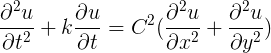

# waterwave-simulator

## Description 

This is the term project for parallel programming course and our team implements the waterwave simulator

## Theory and implementation

In this project, we use this equation to implement waterwave
simulation

where parameters are

- u is the abbreviation of u(x, y, t)
- k is the damping constant
- c is the wave speed

and then we use a few parallel techniques to accelerate this program

## Build 

Make sure that you have installed python3 and pip3

`$ pip3 install -r requirements.txt` to install necessary libraries

TODO : this part is reserved.

## Authors

- [Jim00000](https://github.com/Jim00000)
- [ActKz](https://github.com/ActKz)
- [pityYo](https://github.com/pityYo)

## License

Copyright (C) 2017 the team of Jim00000, ActKz and pityYo

Permission is hereby granted, free of charge, to any person obtaining a copy of this software and associated documentation files (the "Software"), to deal in the Software without restriction, including without limitation the rights to use, copy, modify, merge, publish, distribute, sublicense, and/or sell copies of the Software, and to permit persons to whom the Software is furnished to do so, subject to the following conditions:

The above copyright notice and this permission notice shall be included in all copies or substantial portions of the Software.

THE SOFTWARE IS PROVIDED "AS IS", WITHOUT WARRANTY OF ANY KIND, EXPRESS OR IMPLIED, INCLUDING BUT NOT LIMITED TO THE WARRANTIES OF MERCHANTABILITY, FITNESS FOR A PARTICULAR PURPOSE AND NONINFRINGEMENT. IN NO EVENT SHALL THE AUTHORS OR COPYRIGHT HOLDERS BE LIABLE FOR ANY CLAIM, DAMAGES OR OTHER LIABILITY, WHETHER IN AN ACTION OF CONTRACT, TORT OR OTHERWISE, ARISING FROM, OUT OF OR IN CONNECTION WITH THE SOFTWARE OR THE USE OR OTHER DEALINGS IN THE SOFTWARE.